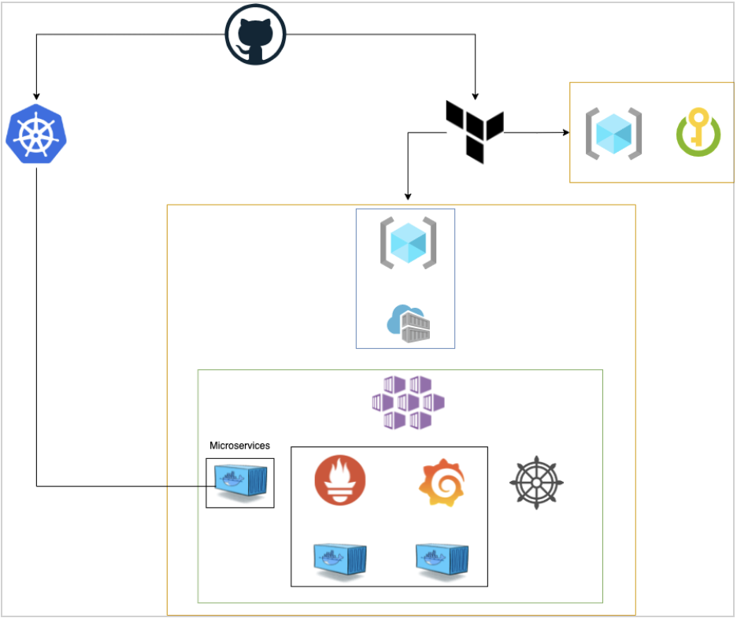
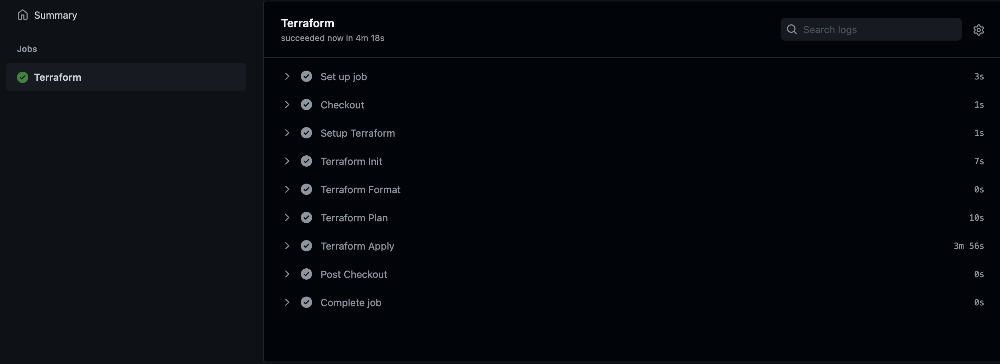

# DOU Demo Project

## 

## Teamates:

### Enrique Carbajal | Juan José Cervantes | Mauricio Wilde

## Project Background

A potential customer has a web application using microservices architecture. This implementation costs more in long terms and will occupy a considerable amount of infrastructure.

We developed this solution to integrate, automate, accelerate and protect the application deployment and infrastructure using Git for version control and branching model, GitHub actions to run automated processes based on Azure Cloud Provider and its services using Kubernetes for running  microservices on an isolated environment and Terraform for Infrastructure as Code.

## Infrastructure

The terraform code deploys on Azure the resources that are going to be used including Azure Container Registry, Azure Kubernetes Service and a Backend Container.

### Github Actions

#### Infrastructure

Github actions is triggered whenever a new commit is uploaded to the main repository.

## Technologies justification

We decided to make the infrastructure on a cloud because on-premise datacenters are becoming obsoletes due to the fact that they are very expensive, also it requires more people to maintain the physical machines. In other hand a cloud infrastructure offers a more flexible, reliable and affordable solution.

We decided to use Azure Cloud because is the cloud where we have more experience, also actually its one of the most reliable cloud solutions offering resources like Azure Kubernetes Service (AKS) and Azure Container Registry (ACR). Using Azure Cloud, you can have all the resources in the same environment and it's easier to handle all of them.

For the Infrastructure as Code (IaC) we used Terraform because is a tool for building and changing infrastructure. In this case it was used to automate the creation of the infrastructure resources, as-well as to have a control of everything that has been built, so with this every change made can be tracked and safely released. In case of a disaster scenario you can just change of resource group, create a new service principal and build again the infrastructure with the Terraform code saving a lot of time and effort.

We used GitHub Actions due to the fact that we can create a complete and kinda simple pipeline to automate the deploy with Terraform. We think GitHub actions is the best option due to the last updates of Azure pipelines, most part of the community is moving from pipelines to GitHub Actions, so we need to stay relevant and use the more popular service if we want to avoid having problems, as well as staying on top with this service.

